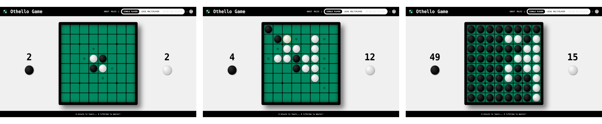

# Othello Game

<details>
    <summary>
        CLICK TO ENLARGE 😇
    </summary>
    📄 <a href="#description">Description</a>
    <br>
    🎓 <a href="#objectives">Objectives</a>
    <br>
    🔨 <a href="#tech-stack">Tech stack</a>
    <br>
    📂 <a href="#files-description">Files description</a>
    <br>
    💻 <a href="#installation_and_how_to_use">Installation and how to use</a>
    <br>
    🔧 <a href="#whats-next">What's next?</a>
    <br>
    ♥️ <a href="#thanks">Thanks</a>
    <br>
    👷 <a href="#authors">Authors</a>
</details>

## 📄 <span id="description">Description</span>

This project, inspired by the [end-of-year work](https://github.com/Rdrg974/holbertonschool-portfolio) of [Rodrigue Hassany Mohamed](https://github.com/Rdrg974) and [Théo Jennat](https://github.com/tjennat) at Holberton School, is a browser-based implementation of the classic Othello (also known as Reversi) board game. The game is designed using HTML5, CSS3, and JavaScript. Players take turns placing black or white discs on the board, flipping the opponent's discs by surrounding them in a straight line. The game continues until neither player can make a valid move, and the player with the most discs on the board wins.

## 🎓 <span id="objectives">Objectives</span>

- Rendering a dynamic game board with valid moves highlighted.
- Implementing the core game mechanics (player turns, disc placement, and flipping).
- Allowing users to restart the game, track scores, and determine the winner.
- Developing a simple algorithm to enable solo gameplay against the computer.
- Enhancing skills in HTML, CSS, and JavaScript while building a complete interactive game.

## 🔨 <span id="tech-stack">Tech stack</span>

<p align="left">
    
    
    
    
    
    
    
</p>

## 📂 <span id="files-description">File description</span>

| **FILE**          | **DESCRIPTION**                                               |
| :---------------: | ------------------------------------------------------------- |
| `assets`          | Contains the resources required for the repository.           |
| `index.html`      | Main HTML file for the Othello Game.                          |
| `about.html`      | Provides information about the Othello Game.                  |
| `rules.html`      | Contains the rules for playing the Othello Game.              |
| `styles.css`      | CSS stylesheet for the Othello Game layout.                   |
| `behavior.js`     | JavaScript code for dynamic page interactions and animations. |
| `othello_game.js` | Contains the core game logic for the Othello Game.            |
| `othello_ai.js`   | Contains the logic for the Othello Game AI.                   |
| `README.md`       | The README file you are currently reading 😉.                 |

## 💻 <span id="installation_and_how_to_use">Installation and how to use</span>

**Installation:**

1. Clone this repository:
    - Open your preferred Terminal.
    - Navigate to the directory where you want to clone the repository.
    - Run the following command:

```
git clone https://github.com/fchavonet/web-othello_game.git
```

2. Open the repository you've just cloned.

**How to use:**

1. Open the `index.html` file in your web browser.

2. Once the page is open, the game board will be displayed with an initial setup of discs.

3. Players take turns clicking on empty cells to place their discs. Valid moves will be highlighted.

4. The score is automatically updated as discs are placed.

5. Press the  button at the top-right to reset the game at any time.

You can also test the game online by clicking [here](https://fchavonet.github.io/web-othello_game/).

<p align="center">
    
</p>

## 🔧 <span id="whats-next">What's next?</span>

- Implement disc-flipping animations.
- Complete the about page.
- Complete the game rules page.
- Improve the overall user interface (UI).
- Add a login system.
- Create an online multiplayer mode.
- Implement a score tracking system with player login.
- Add the ability to save games.
- Enable replays of previous games.
- Introduce a reel AI opponent (with the help of <a href="https://github.com/Eonvorax">Eonvorax</a> specializing in machine learning).

## ♥️ <span id="thanks">Thanks</span>

- A big thank you to my friends Pierre and Yoann, always available to test and provide feedback on my projects.

## 👷 <span id="authors">Authors</span>

**Fabien CHAVONET**
- GitHub: [@fchavonet](https://github.com/fchavonet)
