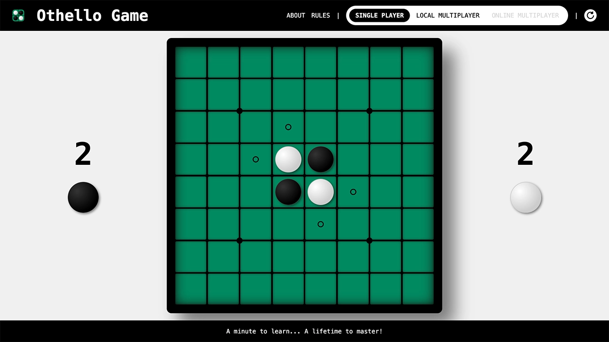
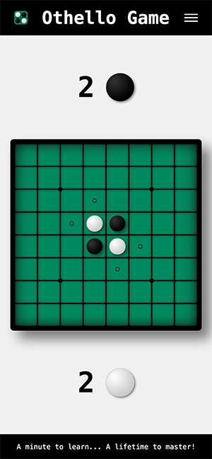

# Othello Game

## Description

This project, inspired by the [end-of-year work](https://github.com/Rdrg974/holbertonschool-portfolio) of [Rodrigue Hassany Mohamed](https://github.com/Rdrg974) and [Théo Jennat](https://github.com/tjennat) at Holberton School, is a browser-based implementation of the classic Othello (also known as Reversi) board game.

The game is designed using HTML5, CSS3, and JavaScript. Players take turns placing black or white discs on the board, flipping the opponent's discs by surrounding them in a straight line. The game continues until neither player can make a valid move, and the player with the most discs on the board wins.

## Objectives

- Render a dynamic game board with valid moves highlighted.
- Implement core game mechanics (player turns, disc placement, and flipping).
- Allow users to restart the game, track scores, and determine the winner.
- Develop a simple algorithm for solo gameplay against the computer.
- Strengthen HTML, CSS, and JavaScript skills by building a complete interactive game.

## Tech Stack


## File Description

| **FILE**          | **DESCRIPTION**                                               |
| :---------------: | ------------------------------------------------------------- |
| `assets`          | Contains the resources required for the repository.           |
| `index.html`      | Main HTML file for the Othello Game.                          |
| `about.html`      | Provides information about the Othello Game.                  |
| `rules.html`      | Contains the rules for playing the Othello Game.              |
| `styles.css`      | CSS stylesheet for the Othello Game layout.                   |
| `behavior.js`     | JavaScript code for dynamic page interactions and animations. |
| `othello_game.js` | Contains the core game logic for the Othello Game.            |
| `othello_ai.js`   | Contains the logic for the Othello Game AI.                   |
| `README.md`       | The README file you are currently reading 😉.                 |

## Installation & Usage

### Installation

1. Clone this repository:
    - Open your preferred Terminal.
    - Navigate to the directory where you want to clone the repository.
    - Run the following command:

```
git clone https://github.com/fchavonet/web-othello_game.git
```

2. Open the cloned repository.

### Usage

1. Open the `index.html` file in your web browser.

2. Once the page is open, the game board will be displayed with an initial setup of discs.

3. Players take turns placing black or white discs on the board, flipping the opponent’s discs when they are surrounded in a straight line.

4. The score is automatically updated as discs are placed.

5. Click the restart button  at the top-right corner to reset the game at any time.

You can also test the project online by clicking [here](https://fchavonet.github.io/full_stack-othello_game/).

<table>
    <tr>
        <th align="center" style="text-align: center;">Desktop view</th>
        <th align="center" style="text-align: center;">Mobile view</th>
    </tr>
    <tr valign="top">
        <td align="center">
            
        </td>
        <td align="center">
            
        </td>
    </tr>
</table>

## What's Next?

- Implement disc-flipping animations.
- Complete the about page.
- Complete the game rules page.
- Improve the overall user interface (UI).
- Add a login system.
- Create an online multiplayer mode.
- Implement a score tracking system with player login.
- Add the ability to save games.
- Enable replays of previous games.
- Introduce a real AI opponent, with the help of [Eonvorax](https://github.com/Eonvorax) specializing in machine learning.

## Thanks

- A big thank you to my friends Pierre and Yoann, always available to test and provide feedback on my projects.

## Author(s)

**Fabien CHAVONET**
- GitHub: [@fchavonet](https://github.com/fchavonet)

